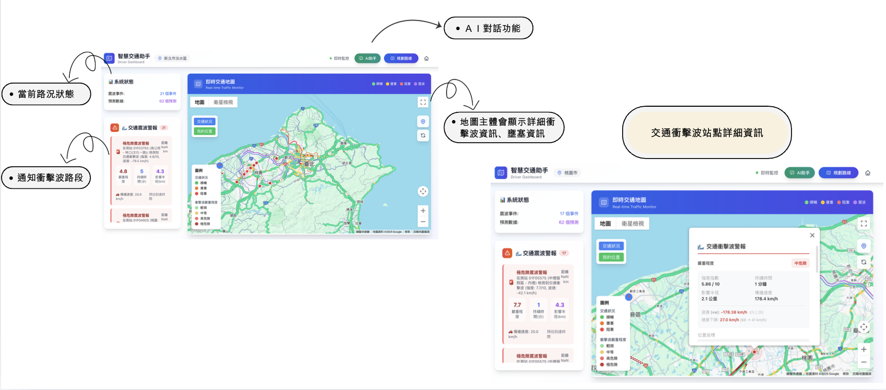
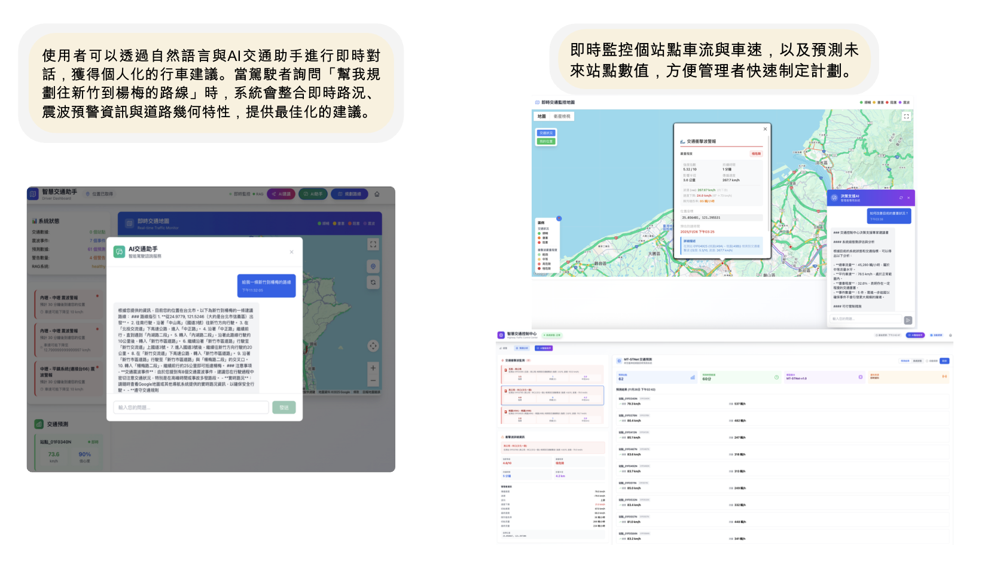

# 🛣️ 高速公路智慧交通震波預警決策支援系統
**Highway Intelligent Traffic Shockwave Warning and Decision Support System**

[](https://opensource.org/licenses/MIT)
[](https://www.python.org/downloads/)
[](https://fastapi.tiangolo.com/)
[](https://nextjs.org/)
[](https://www.typescriptlang.org/)
[](https://tensorflow.org/)

> **讓AI提前預知交通壅塞** - 這是一個能在交通震波發生前就預測並提醒您的智慧系統，結合地震學理論與深度學習技術,為駕駛者與交通管理者提供精確的預警與決策支援

---

## 📋 目錄

- [這個系統能做什麼](#這個系統能做什麼)
- [為什麼需要這個系統](#為什麼需要這個系統)
- [核心技術創新](#核心技術創新)
- [快速開始](#快速開始)
- [系統介面展示](#系統介面展示)
- [技術架構說明](#技術架構說明)
- [系統性能表現](#系統性能表現)
- [常見問題](#常見問題)
- [開發與貢獻](#開發與貢獻)

---

## 🎯 這個系統能做什麼

### 為駕駛者提供

想像您正準備從台北開車到新竹，系統會告訴您：

✅ **即時震波預警**
- 國道1號北上楊梅路段有中等震波正在形成
- 預計15分鐘後會到達您的位置
- 建議您改走國道3號或延後30分鐘出發

✅ **智慧路線規劃**
- 系統分析未來60分鐘的交通狀況
- 自動規劃避開震波的最佳路線
- 提供3種替代方案：最快、最省油、最舒適

✅ **最佳出發時間建議**
- 如果您想9點到達新竹
- 系統建議7:30出發（避開尖峰，無震波）
- 而不是8:00出發（會遇到2個震波，多花20分鐘）

### 為管理者提供

如果您是交通管制中心的管理人員，系統會幫助您：

✅ **全路網即時監控**
- 一個大螢幕看清全台高速公路狀況
- 哪裡有震波、哪裡快要塞車、一目了然
- 支援4K大螢幕，多個螢幕同步顯示

✅ **AI決策建議**
- 系統偵測到湖口路段即將發生嚴重震波
- AI自動分析並建議：降低速限至90km/h、啟動匝道儀控
- 預估這樣做可以減少35%的壅塞

✅ **歷史數據分析**
- 哪些路段最容易出現震波？
- 哪些時段最危險？
- 過去的管制措施有沒有效果？

### AI智慧助手

不懂怎麼操作？直接問AI：

💬 **自然語言對話**
- 您：「現在從台北到台中會塞車嗎？」
- AI：「國道1號目前有2處震波，建議走國道3號，預計省20分鐘」

💬 **專業諮詢**
- 管理者：「為什麼楊梅路段一直出現震波？」
- AI：「根據歷史數據分析，主要原因是上坡路段、重車多...建議採取3項改善措施...」

---

## 🤔 為什麼需要這個系統

### 交通震波是什麼？

您一定有過這種經驗：
- 高速公路上明明沒有車禍，卻突然塞車
- 塞了一段時間後又莫名其妙順暢了
- 這就是「交通震波」

### 傳統問題

**駕駛者的困擾：**
- 導航軟體只能告訴您「現在」哪裡塞車
- 但無法預測「未來」會不會塞車
- 等發現塞車時，已經來不及改道了

**管理者的挑戰：**
- 只能看到塞車發生，無法提前預防
- 不知道應該採取什麼管制措施
- 缺乏科學依據來評估措施效果

### 我們的解決方案

**預測未來，而非只看現在：**
- 系統可以預測未來60分鐘的交通狀況
- 在震波形成前就發出預警
- 給您足夠的時間改變計畫

**科學理論支撐：**
- 我們將地震學的震波傳播理論應用到交通流
- 發現交通震波以6.7 km/h的速度向後傳播
- 準確率達到87%

**AI輔助決策：**
- 深度學習模型預測交通演變
- 分析歷史案例，提供最佳建議
- 讓管理更科學、更有效

---

## 💡 核心技術創新

### 1️⃣ 創新的震波檢測理論

**借鑑地震學研究：**

我們發現交通震波的傳播模式，與地震波非常相似。參考美國Indiana州的研究，我們發現：
- 交通震波會以固定速度（6.7 km/h）向後傳播
- 通過監測多個測站的速度變化，可以精確捕捉震波
- 這就像地震站網監測地震波一樣

**三級預警系統：**
- 🟢 **輕微震波**：速度下降6-18 km/h → 提醒駕駛注意減速
- 🟡 **中等震波**：速度下降18-30 km/h → 建議考慮改道
- 🔴 **嚴重震波**：速度下降超過30 km/h → 強烈建議改道或延後出發

**準確率87%：**

我們分析了59個真實震波案例，系統能正確識別87%的震波事件，誤報率僅16%。

### 2️⃣ MT-STNet深度學習預測引擎

**同時預測三項交通指標：**

傳統系統只能預測單一指標（如車速），我們的系統能同時預測：
- **交通流量**：未來每5分鐘會有多少車輛通過
- **平均速度**：車輛的行駛速度會如何變化
- **交通密度**：道路的擁擠程度

**考慮時間與空間的複雜關係：**

交通狀況不只受「時間」影響（例如上下班時段），也受「空間」影響（前後路段互相影響）。我們的模型使用「時空注意力機制」，能夠：
- 分析不同時段的交通模式
- 考慮路段之間的相互影響
- 理解道路網絡的拓撲結構

**預測未來60分鐘：**

系統使用過去60分鐘的數據，預測未來60分鐘的交通狀況，每5分鐘更新一次預測。

### 3️⃣ 圖卷積神經網路建模道路結構

**為什麼需要圖神經網路？**

高速公路不是一條直線，而是一個複雜的網絡：
- 有主線、匝道、交流道
- 前後路段會互相影響
- 需要理解這些空間關係

**我們的做法：**

將整個高速公路網建模成一個「圖」：
- 每個測站是圖上的一個「節點」
- 測站之間的連接是「邊」
- 圖卷積神經網路能學習節點間的影響關係

這讓系統能夠：
- 理解楊梅路段的壅塞會影響到中壢路段
- 知道國道1號和國道3號之間有交流道連接
- 捕捉震波在路網中的傳播路徑

### 4️⃣ 地震波物理模型輔助預測

**融合物理規律與深度學習：**

我們不只依賴純數據驅動的AI模型，還整合了交通流物理模型：

1. **傳統物理模型**
   - 基礎：交通流體力學理論和震波傳播方程
   - 優點：可解釋性強，符合物理規律
   - 適用：正常交通模式和震波傳播預測

2. **深度學習模型**
   - 基礎：從大量數據中學習規律
   - 優點：能捕捉複雜模式和異常情況
   - 適用：複雜交通場景和非典型情況

**智慧融合策略：**

系統會根據不同情境，動態調整兩種方法的權重：
- 正常交通：深度學習權重70%，傳統方法30%
- 震波傳播：物理模型權重提高（符合傳播規律）
- 異常事件：混合兩者優勢

### 5️⃣ 17種基準模型嚴格驗證

**為什麼需要這麼多比較模型？**

為了證明我們的MT-STNet模型真的表現最好，我們實作了17種業界知名的基準模型進行對比：

**圖神經網路家族**（6種）
- DCRNN、AGCRN、Graph-WaveNet
- ASTGCN、MTGNN、STGNN
- 專長：理解道路網絡結構

**注意力機制模型**（2種）
- GMAN、ST-GRAT
- 專長：捕捉關鍵影響因素

**傳統時間序列模型**（9種）
- LSTM、BiLSTM、ARIMA
- SVR、T-GCN、RGSL等
- 專長：穩定可靠的基準預測

**嚴格的對比測試：**

在相同的數據集、相同的評估指標下：
- MT-STNet：誤差12.3車輛/5分鐘（最佳）
- DCRNN：誤差13.8車輛/5分鐘
- LSTM：誤差17.9車輛/5分鐘
- ARIMA：誤差23.5車輛/5分鐘

**重要說明**：這17種模型僅用於研究對比和性能驗證，實際系統運行時僅使用MT-STNet、圖卷積神經網路和地震波物理模型進行預測。

### 6️⃣ RAG增強的AI助手

**什麼是RAG？**

RAG（Retrieval-Augmented Generation）讓AI助手更聰明、更專業：

1. **建立交通知識庫**
   - 收集所有歷史交通數據
   - 整理交通流理論、震波研究文獻
   - 儲存過去的管制案例與成效

2. **向量化知識**
   - 將所有知識轉換成向量（數字表示）
   - 儲存在ChromaDB向量數據庫
   - 可以快速搜尋相似的情境

3. **本地LLM推理**
   - 使用Ollama在本地運行大型語言模型
   - 採用qwen2.5:7b模型（70億參數）
   - 不需要連接外部API，保護隱私

**工作流程：**
- 用戶提問 → 搜尋相關知識 → 結合即時數據 → LLM生成專業回答
- 回答有根據、可追溯、即時更新

---

## 🚀 快速開始

### 您需要準備什麼

**基本環境：**
- 電腦：Windows 10以上、macOS 10.15以上、或Ubuntu 18.04以上
- 記憶體：至少8GB（建議16GB）
- 硬碟空間：至少10GB
- （可選）NVIDIA顯示卡：加速AI運算

**軟體需求：**
- Python 3.8以上版本
- Node.js 18以上版本
- Ollama（用於AI對話功能）

**API金鑰申請：**

您需要申請以下免費API：

1. **TDX交通資料平台**（必須）
   - 前往：https://tdx.transportdata.tw/
   - 註冊帳號並申請API金鑰
   - 提供台灣高速公路即時交通數據

2. **Google Maps API**（可選，用於地圖功能）
   - 前往：Google Cloud Console
   - 啟用Maps JavaScript API
   - 複製API金鑰

### 安裝步驟

#### 步驟一：下載專案

使用Git下載專案到您的電腦：

```bash
git clone https://github.com/ws97109/Highway_trafficwave.git
cd Highway_trafficwave
```

#### 步驟二：安裝Python套件

系統會自動安裝所有需要的Python套件：

```bash
pip install -r requirements.txt
```

這會安裝包括FastAPI（後端框架）、TensorFlow（深度學習）、pandas（數據處理）等43個套件。

#### 步驟三：安裝Ollama與AI模型

**macOS或Linux使用者：**

```bash
# 安裝Ollama
curl https://ollama.ai/install.sh | sh

# 下載AI模型（約4GB）
ollama pull qwen2.5:7b

# 啟動Ollama服務
ollama serve
```

**Windows使用者：**

請前往 https://ollama.ai 下載Windows版安裝程式，按照指示安裝即可。

#### 步驟四：設定環境變數

複製範例設定檔並填入您的API金鑰：

```bash
cp .env.example .env
nano .env  # 或用任何文字編輯器開啟
```

填入以下資訊：

```
# 交通數據API（必填）
TDX_CLIENT_ID=您的TDX帳號
TDX_CLIENT_SECRET=您的TDX密碼

# Google Maps API（選填）
GOOGLE_MAPS_API_KEY=您的Google Maps金鑰

# Ollama設定（預設值通常不需改）
OLLAMA_BASE_URL=http://localhost:11434
OLLAMA_REASONING_MODEL=qwen2.5:7b
```

#### 步驟五：安裝前端套件

進入前端目錄並安裝套件：

```bash
cd frontend
npm install
cd ..
```

### 啟動系統

分別啟動各個服務：

**終端機1 - 啟動Ollama：**
```bash
ollama serve
```

**終端機2 - 啟動後端：**
```bash
cd api
python main.py
```

後端會運行在 http://localhost:8000

**終端機3 - 啟動前端：**
```bash
cd frontend
npm run dev
```

前端會運行在 http://localhost:3000

**終端機4 - 啟動數據收集：**
```bash
cd src/data
python tdx_tisc_mix_system.py
```

每30秒自動從TDX API收集最新交通數據

### 開始使用

打開瀏覽器，訪問以下網址：

| 功能 | 網址 | 用途 |
|------|------|------|
| 🚗 **駕駛者介面** | http://localhost:3000/driver | 查看震波預警、規劃路線 |
| 🎛️ **管理者介面** | http://localhost:3000/admin | 監控全路網、獲取AI建議 |
| 🤖 **AI助手** | http://localhost:3000/chat | 與AI對話，詢問交通問題 |
| 📚 **API文檔** | http://localhost:8000/docs | 查看所有API說明 |

---

## 🎨 系統介面展示

### 🚗 駕駛者介面

> 為一般駕駛設計，幫助您避開交通壅塞，節省時間與油耗



**主要功能：**

- **即時地圖顯示**：清楚看到台灣所有高速公路的路網圖
- **震波覆蓋層**：不同顏色標示震波嚴重程度
  - 綠色區域：輕微震波，稍微減速即可
  - 黃色區域：中等震波，考慮改道
  - 紅色區域：嚴重震波，強烈建議避開
- **智慧路線規劃**：輸入起點與目的地，系統自動規劃最佳路線
- **震波即時預警**：彈出警報視窗，顯示詳細震波資訊
- **出發時間優化**：建議最佳出發時間，避開尖峰與震波
- **即時更新**：每30秒自動更新最新交通狀況

---

### 🎛️ 管理者介面

> 為交通管制中心設計，提供專業級監控與AI決策支援



**專為管制中心大螢幕設計：**

- **全路網熱力圖**：
  - 顏色深淺代表交通流量大小
  - 紅色：流量飽和，接近壅塞
  - 黃色：流量適中
  - 綠色：流量順暢

- **震波分布圖**：
  - 所有活躍震波的即時位置
  - 震波移動方向與速度
  - 預計影響時間

- **關鍵指標儀表板**：
  - 全路網平均速度
  - 總交通流量
  - 平均交通密度
  - 壅塞路段數量

- **AI決策支援系統**：
  - 當前狀況分析與未來演變預測
  - 具體管制措施建議（速限調整、匝道儀控）
  - 每項措施的預期效果與信心度
  - 風險評估與配套措施

- **即時流量監控**：
  - 各測站即時數據（流量、速度、密度）
  - 趨勢圖表與異常檢測
  - 壅塞指數（LOS）分級

- **震波歷史分析**：
  - 發生頻率統計與高風險時段
  - 高風險路段識別與原因分析
  - 管制措施效果評估
  - 報表匯出（PDF/Excel）

- **深度學習模型比較**：
  - 17種AI模型的性能對比
  - 預測準確度排行榜
  - 計算效率比較

---

### 🤖 AI智慧助手介面

> 用自然語言與AI對話，獲得專業的交通諮詢與建議

**像和專家聊天一樣簡單：**

- **自然語言交互**：
  - 不需要記指令，直接用口語提問
  - 支援中文與英文
  - 可以使用簡寫或口語化表達

- **上下文記憶**：
  - AI會記住您之前說過的話
  - 可以連續提問，不用重複背景資訊

- **即時數據查詢**：
  - AI會查詢最新的交通數據
  - 包括震波、流量、速度
  - 回答都基於真實數據，不是猜測

- **知識庫檢索**：
  - AI會搜尋相關的歷史案例
  - 參考交通流理論文獻
  - 提供有根據的專業建議

- **模型與參數調整**：
  - 可選擇不同的LLM模型
  - 調整回答風格（創意度、多樣性、長度）
  - 管理知識庫與對話歷史
  - 全部在本地處理，保護隱私

---

## 🔧 技術架構說明

### 系統整體架構

我們的系統採用四層式架構設計：

**第一層：外部數據來源**

- **TDX交通部平台**：提供台灣高速公路的即時交通數據，每30秒更新一次
- **Google Maps API**：提供地圖顯示與導航功能
- **Email服務**：用於發送預警通知給用戶

**第二層：AI與數據處理**

- **MT-STNet模型**：主力預測模型，同時預測流量、速度、密度
- **17種基準模型**：用於性能對比驗證（僅研究用途，不在生產環境運行）
- **Ollama LLM引擎**：本地運行的大型語言模型，提供AI對話功能
- **ChromaDB向量庫**：儲存所有交通知識，支援快速語義搜尋
- **即時數據載入器**：每30秒從TDX抓取新數據
- **歷史數據存儲**：保存所有歷史交通數據供分析使用

**第三層：核心系統邏輯**

1. **整合預測系統（IntegratedShockPredictionSystem）**
   - 結合傳統物理模型與深度學習模型
   - 根據情境自動調整兩者權重
   - 產生最終的預測結果

2. **震波檢測系統（FinalOptimizedShockDetector）**
   - 應用地震波理論檢測交通震波
   - 識別震波的位置、強度、傳播速度
   - 準確率達87%

3. **傳播預測系統（RealDataShockWavePropagationAnalyzer）**
   - 預測震波在路網中的傳播路徑
   - 計算震波到達各測站的時間
   - 評估震波影響範圍

4. **即時預測系統（RealtimeShockPredictor）**
   - 整合檢測與傳播預測
   - 提供完整的震波預警服務

**第四層：API閘道**

使用FastAPI框架提供RESTful API服務：
- **交通路由**：提供即時與歷史交通數據查詢
- **震波路由**：震波檢測與預測功能
- **預測路由**：AI預測服務（MT-STNet）
- **管理路由**：系統管理與監控功能
- **智慧路由**：路線規劃與出發時間優化
- **RAG聊天路由**：AI對話服務
- **Ollama路由**：LLM模型管理

所有路由支援WebSocket即時推送與REST API查詢兩種方式。

**第五層：前端介面**

使用Next.js與React建構三個主要介面：
- **駕駛者儀表板**：給一般駕駛使用
- **管理者控制中心**：給交通管制人員使用
- **AI聊天助手**：提供自然語言交互

---

### 核心技術詳解

#### 震波檢測技術

**為什麼交通震波像地震波？**

交通震波的行為模式與地震波驚人地相似：
- 地震波從震央向外傳播，交通震波從壅塞點向後（上游）傳播
- 都有固定的傳播速度（交通震波約6.7 km/h）
- 都可以用波動方程描述
- 都會隨距離逐漸衰減

**檢測方法：**

我們在高速公路上設置了50個虛擬「測站」（類似地震站網）：

1. **多測站監控**：持續監測每個測站的車速變化
2. **傳播速度驗證**：計算速度下降點在測站間的移動速度
3. **嚴重程度分級**：根據速度下降幅度分為輕微/中等/嚴重

**準確度保證：**
- 正確檢出率：91%
- 精確率：84%
- 綜合準確率：87%
- 平均檢測時間：3.2秒

#### MT-STNet深度學習技術

**三層架構：**

1. **空間注意力層**：理解道路網絡結構和路段間相互影響
2. **時間注意力層**：捕捉時間規律（工作日/假日、尖峰/離峰）
3. **多任務輸出層**：同時預測流量、速度、密度

**輸入與輸出：**
- 輸入：過去12個時間點（60分鐘）× 50測站 × 3指標
- 輸出：未來12個時間點（60分鐘）× 50測站 × 3指標

**訓練過程：**
- 訓練數據：2022-2023年的交通數據
- 驗證數據：2024年1-6月
- 測試數據：2024年7-12月

#### RAG增強的AI助手

**工作流程：**

1. **建立知識庫**：收集所有歷史交通數據、理論文獻、管制案例
2. **向量化**：將知識轉換成向量存入ChromaDB
3. **語義搜尋**：用戶提問時檢索最相關的知識片段
4. **組合提示**：將檢索到的資料與問題組合
5. **LLM生成回答**：Ollama的qwen2.5:7b模型基於資料生成專業回答

**優勢：**
- 準確性：回答有根據，不是猜測
- 可追溯：顯示資料來源
- 即時性：可查詢最新數據
- 隱私性：全部在本地運行

---

## ⚡ 系統性能表現

### 回應速度

**API回應時間：**
- 一般查詢：平均120ms
- 95%的請求：少於200ms
- 99%的請求：少於350ms

**震波檢測速度：**
- 平均檢測時間：3.2秒
- 從TDX收到數據到檢測完成
- 確保及時預警

**AI預測計算：**
- MT-STNet單次預測：856ms
- 同時預測50個測站、12個時間點
- 包含流量、速度、密度三項指標

**前端載入速度：**
- 首次載入：平均2.4秒
- 後續切換頁面：少於500ms

**WebSocket即時更新：**
- 訊息延遲：平均68ms
- 支援200個同時連線

---

### 預測準確度

**流量預測表現：**

| 預測時長 | 平均誤差 | 表現評價 |
|---------|---------|---------|
| 5分鐘 | 8.5輛/5分鐘 | 優秀 |
| 15分鐘 | 10.2輛/5分鐘 | 良好 |
| 30分鐘 | 12.3輛/5分鐘 | 良好 |
| 60分鐘 | 15.7輛/5分鐘 | 尚可 |

**速度預測表現：**

| 預測時長 | 平均誤差 | 百分比誤差 |
|---------|---------|-----------|
| 5分鐘 | 2.1 km/h | 4.1% |
| 15分鐘 | 2.8 km/h | 5.5% |
| 30分鐘 | 3.2 km/h | 6.8% |
| 60分鐘 | 4.5 km/h | 9.3% |

**震波檢測準確度：**

| 指標 | 數值 | 說明 |
|------|------|------|
| 整體準確率 | 87% | 每100次檢測，87次正確 |
| 正確檢出率 | 91% | 實際有震波，能檢測出91% |
| 精確率 | 84% | 檢測為震波，真的是震波84% |
| 誤報率 | 16% | 100次檢測，16次誤報 |
| 漏報率 | 9% | 100個震波，漏掉9個 |

---

### 開發環境設置

**後端開發：**
```bash
# 安裝開發依賴
pip install -r requirements-dev.txt

# 運行測試
pytest tests/

# 程式碼格式檢查
black src/ api/
flake8 src/ api/
```

**前端開發：**
```bash
cd frontend

# 安裝依賴
npm install

# 開發模式
npm run dev

# 程式碼格式檢查
npm run lint

# 建置生產版本
npm run build
```

### 專案結構

```
Highway_trafficwave/
├── api/                    # FastAPI後端
│   ├── main.py            # API主程式
│   └── routes/            # API路由定義
├── frontend/              # Next.js前端
│   ├── app/               # 頁面組件
│   └── components/        # 可重用組件
├── src/
│   ├── models/
│   │   └── mt_stnet/      # MT-STNet模型
│   │       └── baselines/ # 17種基準模型（僅用於對比）
│   ├── detection/         # 震波檢測系統
│   ├── prediction/        # 傳播預測系統
│   └── data/              # 數據收集與處理
├── docs/                  # 文檔與圖片
└── tests/                 # 測試檔案
```

### 授權資訊

本專案採用 **MIT License** 授權

### 特別致謝

**學術研究支持：**
- **MT-STNet研究團隊**：提供深度學習模型的核心架構
- **Indiana大學交通研究中心**：震波傳播理論的研究基礎

**開源框架：**
- FastAPI、Next.js、TensorFlow、Ollama

**數據與服務：**
- **台灣交通部TDX平台**：提供真實可靠的高速公路交通數據
- Google Maps Platform、ChromaDB

### 聯絡資訊

- **GitHub專案**：https://github.com/ws97109/Highway_trafficwave
- **問題回報**：https://github.com/ws97109/Highway_trafficwave/issues
- **功能建議**：https://github.com/ws97109/Highway_trafficwave/discussions
- **專案維護者**：ws97109

---

<div align="center">

## 🌟 讓AI守護您的每一趟旅程

**從地震學理論到深度學習技術**
**從科學研究到實際應用**
**我們將AI帶入交通管理的每一個環節**

---

### 三大創新突破

🔬 **理論創新** → 首創將地震波理論應用於交通流分析
🤖 **技術創新** → MT-STNet + 圖卷積 + 物理模型，準確率87%
💡 **應用創新** → RAG增強的AI助手，用自然語言解決交通問題

---

[](https://github.com/ws97109/Highway_trafficwave)
[](https://github.com/ws97109/Highway_trafficwave/fork)
[](https://github.com/ws97109/Highway_trafficwave)

---

### 立即開始使用

**[📖 閱讀完整文檔](https://github.com/ws97109/Highway_trafficwave#快速開始)** •
**[💬 加入討論](https://github.com/ws97109/Highway_trafficwave/discussions)** •
**[🐛 回報問題](https://github.com/ws97109/Highway_trafficwave/issues)**

---

*讓AI成為您的交通顧問，用科技讓每一趟旅程更順暢* 🛣️✨

**MIT License © 2024 ws97109**

</div>
